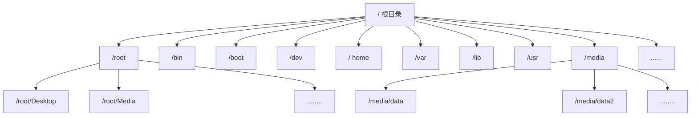

### **Vim 编辑器与shell 命令脚本**

##### VIm 文本编辑器

###### VIM编辑切换的方法

命令模式：控制光标移动，可对文本进行复制、粘贴、删除和查找等工作。

输入模式：正常的文本录入。

末行模式：保存或退出文档，以及设置编辑环境。


```sequence
输入模式-->命令模式:Esc健
命令模式->输入模式:a、i、o 等健
末行模式-->命令模式: Esc健
命令模式->末行模式: : 健
```


###### VIm中常用的命令

| 命令 | 作用                               |
| ---- | ---------------------------------- |
| dd   | 删除剪贴（整行）                   |
| yy   | 复制光标所在行                     |
| n    | 显示搜索命令定位到的下一个字符     |
| N    | 显示搜索命令定位到的上一个字符     |
| u    | 撤销上一步的操作                   |
| p    | 将删除dd yy 过的数据粘贴到光标后面 |


###### 末行模式中可用的命令

| 命令          | 作用                                 |
| ------------- | ------------------------------------ |
| :w            | 保存                                 |
| :q            | 退出                                 |
| :q!           | 强制退出（放弃对文档的修改内容）     |
| :wq!          | 强制保存退出                         |
| :set nu       | 显示行号                             |
| :set nonu     | 不显示行号                           |
| :命令         | 执行该命令                           |
| :整数         | 跳转到该行                           |
| :s/one/two    | 将当前光标所在行的第一个one替换成two |
| :s/one/two/g  | 将当前光标所在行的所有one替换成two   |
| :%s/one/two/g | 将全文中的所有one替换成two           |
| ?字符串       | 在文本中从下至上搜索该字符串         |
| /字符串       | 在文本中从上至下搜索该字符串         |

##### 编写Shell 脚本

###### shell 简单介绍

1. ​	交互式（Interactive）：用户每输入一条命令就立即执行。
2. ​	批处理（Batch）：由用户事先编写好一个完整的Shell脚本，Shell会一次性执行脚本中诸多的命令。
3. 查看SHELL变量可以发现当前系统已经默认使用Bash作为命令行终端解释器了：

```shell
[root@linuxprobe ~]# echo $SHELL/bin/bash
```

###### 编写简单的脚本

1. 实现查看当前路径，并显示目录下的所有文件及属性信息。


```shell
[root@linuxprobe ~]# vim example.sh
#!/bin/bash 
#For Example BY linuxprobe.com 
pwd 
ls -al
```

解析：

1. 文件名随意，但是需要以.sh 结尾，分辨文件。
2. "#!" 声明shell 解释器执行脚本
3. "#" 是注释：对该脚本说明
4. “剩下就是系统执行命令”

注意：权限问题

```shell
[root@linuxprobe ~]# ./example.sh
bash: ./Example.sh: Permission denied
[root@linuxprobe ~]# chmod u+x example.sh
[root@linuxprobe ~]# ./example.sh
/root/Desktop
total 8
drwxr-xr-x. 2 root root 23 Jul 23 17:31 .
dr-xr-x---. 14 root root 4096 Jul 23 17:31 ..
-rwxr--r--. 1 root root 55 Jul 23 17:31 example.sh
```

###### 接收用户的参数

1. Linux 系统中的shell ，已经内设用于接收参数变量，变量之间使用空格间隔。

2. 接受参数介绍

   1. "$#" 总共有几个参数

   2. "$*" 对应所有的位置参数(变量参数)

   3. ”$?“ 对应上一次的返回值（上一次命令返回的结果）

   4. ”$0“ 对应当前执行脚本名称

   5. ”$1,$2,$3“ $n 对应相应数字的位置参数

      

3.练习

```shell
[root@linuxprobe ~]# vim example.sh
#!/bin/bash
echo "当前脚本名称为$0"
echo "总共有$#个参数，分别是$*。"
echo "第1个参数为$1，第5个为$5。"
[root@linuxprobe ~]# sh example.sh one two three four five six
当前脚本名称为example.sh
总共有6个参数，分别是one two three four five six。
第1个参数为one，第5个为five。
```

###### 判断用户参数

1. shell 条件测试语法是否成立，成立返回数字0，不成立返回其他随机数字。

2. 注意：条件表达式两边均有一个空格!

   

3. 测试对象划分

   ```
   1、文件测试语句
   2、逻辑测试语句
   3、整数值比较语句
   4、字符串比较语句
   ```

   

4. 文件测试语句

   | 操作符 | 作用                        |
   | ------ | --------------------------- |
   | -d     | 测试文件是否为目录类型      |
   | -e     | 测试文件是否存在            |
   | -f     | 判断是为一般文件            |
   | -r     | 测试当前用户是否有 可读权限 |
   | -w     | 测试当前用户是否有权限写入  |
   | -x     | 测试当前用户是否有权限执行  |

   下面使用文件测试语句来判断/etc/fstab是否为一个目录类型的文件

   ```shell
   [root@iZwz9cn05w4ymx9od6osvkZ ~]# [ -d /etc/fstab ]
   [root@iZwz9cn05w4ymx9od6osvkZ ~]# echo $?
   1
   ```

   再使用文件测试语句来判断/etc/fstab是否为一般文件

   ```shell
   [root@iZwz9cn05w4ymx9od6osvkZ ~]# [ -f /etc/fstab ]
   [root@iZwz9cn05w4ymx9od6osvkZ ~]# echo $?
   0
   ```

5. 逻辑测试语句

   1. "与"  运算符号 &&，表示当前命令执行成功后才会执行它后面的命令。 

      ```shell
      判断/dev/cdrom 文件是否存在，若纯在则输出Exist 字样
      [root@iZwz9cn05w4ymx9od6osvkZ ~]# [ -e /dev/cdrom ] && echo "Exist"
      [root@iZwz9cn05w4ymx9od6osvkZ ~]# echo $?
      1
      [root@iZwz9cn05w4ymx9od6osvkZ ~]# [ -e /dev ] && echo "Exist"
      Exist
      
      ```

   2. “或” 运算符号 || ，表示当前命令执行失败后才会执行它后面的命令

      ```shll
      判断当前用户是否是管理员身份
      [tang@iZwz9cn05w4ymx9od6osvkZ root]$ [ $USER = root ] || echo "user"
      user
      ```

   3. "非"运算符号(! )，把条件测试中的判断结果取相反，如果结果是正确的，则将其变成错误的，测试错误的结果则将其变成正确的。

   ```shell
   判断当前用户是否为一个非管理员的用户，由于判断结果因为两次否定而变成正确，因此会正常的输出预设信息
   [root@iZwz9cn05w4ymx9od6osvkZ ~]# [ $USER != root ] || echo "administrator"
   administrator
   [root@iZwz9cn05w4ymx9od6osvkZ ~]# echo $?
   0
   [root@iZwz9cn05w4ymx9od6osvkZ ~]# su tang
   [tang@iZwz9cn05w4ymx9od6osvkZ root]$ [ $USER != root ] || echo "administrator"
   [tang@iZwz9cn05w4ymx9od6osvkZ root]$ echo $?
   0
   [tang@iZwz9cn05w4ymx9od6osvkZ root]$ [ $USER != root ] || echo "administrator"
   [tang@iZwz9cn05w4ymx9od6osvkZ root]$ echo $?
   0
   [tang@iZwz9cn05w4ymx9od6osvkZ root]$ exit
   exit
   [root@iZwz9cn05w4ymx9od6osvkZ ~]# [ $USER != root ] || echo "administrator"
   administrator
   [root@iZwz9cn05w4ymx9od6osvkZ ~]# echo $?
   0
   ```

   ```shell
   先判断当前登陆用户的USER变量名称是否等于root,然后用逻辑运算符“非”，进行取反操作，效果就变成了判断当前登陆的用户是否为非管理员用户了。若最后的条件成立则会根据逻辑“与”，运算符输出user 字样，或条件不满足则会通过逻辑“或”，运算符输出root 字样，而如果前面的&&不成立才会执行后面||的符号。
   [root@iZwz9cn05w4ymx9od6osvkZ ~]# [ $USER != root ] && echo "user" || echo "root"
   root
   [root@iZwz9cn05w4ymx9od6osvkZ ~]# su tang
   [tang@iZwz9cn05w4ymx9od6osvkZ root]$ [ $USER != root ] && echo "user" || echo "root"
   user
   [tang@iZwz9cn05w4ymx9od6osvkZ root]$ 
   
   ```

   

6. 可用的整数比较运算符

   1. 整数比较运算符仅对数字操作

      | 操作符 | 作用           |
      | ------ | -------------- |
      | -eq    | 是否等于       |
      | -ne    | 是否不等于     |
      | -gt    | 是否大于       |
      | -lt    | 是否小于       |
      | -le    | 是否等于或小于 |
      | -ge    | 是否大于或等于 |

      ```shell
      是否大于
      [root@iZwz9cn05w4ymx9od6osvkZ ~]# [ 10 -gt 10 ]
      [root@iZwz9cn05w4ymx9od6osvkZ ~]# echo $?
      1
      是否等于
      [root@iZwz9cn05w4ymx9od6osvkZ ~]# [ 10 -eq 10 ]
      [root@iZwz9cn05w4ymx9od6osvkZ ~]# echo $?
      0
      
      ```

      

7. free 

   1. 使用

      1. 获取当前系统正在使用的内存量信息.正在使用，及可用的内存信息量。
      2. free -m 查看内存使用量 单位(mb) 
      3. 通过grep Men ：过滤剩余内存量的行.
      4. 使用 awk "{print $4}" 命令值保留第4列
      5. 最后使用FreeMem =  语句 的方式把语句内执行的结果赋值给变量。

      ```shell
      [root@iZwz9cn05w4ymx9od6osvkZ ~]# free -m
                    total        used        free      shared  buff/cache   available
      Mem:           7821        5222         183          13        2414        2286
      Swap:             0           0           0
      [root@iZwz9cn05w4ymx9od6osvkZ ~]# free -m |grep  Mem:
      Mem:           7821        5247         154          13        2420        2262
      [root@iZwz9cn05w4ymx9od6osvkZ ~]# free -m | grep Mem: | awk "{print $4}"
      Mem:           7821        5249         151          13        2420        2259
      [root@iZwz9cn05w4ymx9od6osvkZ ~]# free -m | grep Mem: | awk '{print $4}'
      155
      [root@iZwz9cn05w4ymx9od6osvkZ ~]# free -m | grep Mem: | awk '{print $4}'
      155
      [root@iZwz9cn05w4ymx9od6osvkZ ~]# FreeMen="free -m | grep Men: | awk '{print $4}'"
      [root@iZwz9cn05w4ymx9od6osvkZ ~]# FreeMen="free -m |grep Men: | awk '{print $4}'"
      [root@iZwz9cn05w4ymx9od6osvkZ ~]# echo $FreeMem 
      
      [root@iZwz9cn05w4ymx9od6osvkZ ~]# echo $FreeMem
      
      [root@iZwz9cn05w4ymx9od6osvkZ ~]# FreeMem=`free -m | grep Mem: | awk '{print $4}'`
      [root@iZwz9cn05w4ymx9od6osvkZ ~]# echo $FreeMem
      141
      [root@iZwz9cn05w4ymx9od6osvkZ ~]# 
      ```

      

   2. free 参数详解

      ```shell
      [root@iZwz9cn05w4ymx9od6osvkZ ~]# free -m
                    total        used        free      shared  buff/cache   available
      Mem:           7821        5231         188          13        2401        2277
      Swap:             0           0           0
      ```

      | 参数       | 说明                                |
      | ---------- | ----------------------------------- |
      | Mem        | 内存使用信息                        |
      | Swap       | 交换空间的使用信息                  |
      | total      | 系统总的可用物理内存大小            |
      | used       | 已被使用的物理内存大小              |
      | free       | 被共享使用的物理可用                |
      | shared     | 被共享使用的物理内存大小            |
      | buff/cache | 被buffer 和cache 使用的物理内存大小 |
      | available  | 还可以被应用程序使用的物理内存大小  |

   3. 判断内存可用量是否小于1024 若小于提示 “Insufficient Memory”

      ```shell
      [root@iZwz9cn05w4ymx9od6osvkZ ~]# [ $FreeMem -lt 1024 ] && echo "Insufficient Memory"
      Insufficient Memory
      [root@iZwz9cn05w4ymx9od6osvkZ ~]#
      ```

      

8. 字符串比较运算符

   1. 字符串比较语句用来判断字符串是否为空值。，或两个字符串是否相同。判断某个变量是否未被定义。

   2. 操作符的作用介绍。

      | 操作符 | 作用                   |
      | ------ | ---------------------- |
      | =      | 比较字符串内容是否相同 |
      | !=     | 比较字符串内容是否不同 |
      | -z     | 判断字符串内容是否为空 |

      判断sting 是否为空值

      ```shell
      [root@iZwz9cn05w4ymx9od6osvkZ ~]# [-z $string]
      -bash: [-z: command not found
      [root@iZwz9cn05w4ymx9od6osvkZ ~]# [ -z $string]
      [root@iZwz9cn05w4ymx9od6osvkZ ~]# echo $?
      0
      [root@iZwz9cn05w4ymx9od6osvkZ ~]# 
      ```

      保存当前语系环境变量值LANG 不是英语。满足条件输出NOT en.US

      ```shell
      [root@iZwz9cn05w4ymx9od6osvkZ ~]# echo $LANG
      en_US.UTF-8
      [root@iZwz9cn05w4ymx9od6osvkZ ~]# [ $LANG != 'en.US' ] && echo "Net en.US"
      Net en.US
      [root@iZwz9cn05w4ymx9od6osvkZ ~]# 
      ```

###### 单引号双引号

1. 单引号属于强引用，它会忽略所有被引用起来的字符的特殊处理，被引用起来的字符会被原封不动的被使用，唯一需要注意点是不允许引用自身。

2. 双引号属于弱引用，它会对一些被引起来的字符进行特殊处理，主要包括以下情况

   1. $加变量 名可以获取变量值

      ```shell
      [root@iZwz9cn05w4ymx9od6osvkZ ~]# echo "$PWD"
      /root
      ```

   2. 反引号和$() 引起来的字符会被当做命令执行后替换原来字符

      1. ```shell
         [root@iZwz9cn05w4ymx9od6osvkZ ~]#  echo '$PWD'
         $PWD
         [root@iZwz9cn05w4ymx9od6osvkZ ~]#  echo "$PWD"
         /root
         ```

      2. ```shell
         [root@iZwz9cn05w4ymx9od6osvkZ ~]# echo '$(echo hello world)'
         $(echo hello world)
         [root@iZwz9cn05w4ymx9od6osvkZ ~]# echo "$(echo hello world)"
         hello world
         [root@iZwz9cn05w4ymx9od6osvkZ ~]# echo '`echo hello world`'
         `echo hello world`
         [root@iZwz9cn05w4ymx9od6osvkZ ~]#  echo "`echo hello world`"
         hello world
         ```


##### 流程控制语句

###### if 条件测试语句

1. if 语句分为单只结构、双只结构、多分支结构
2. 单分支语句 组成 关键字if;then;fi ,在条件成立后才执行的命令,相当于口语 “如果....那么....”


单分支if 语句

if 语句判断/media/cdrom 文件是否存在，存在判断结束，不存在创建目录

```shell
#/bin/bash
DIR="/media/cdrom"

if [ ! -e $DIR ]
then
mkdir -p $DIR
fi
~                                                                                                                                                                                                         
~ 

[root@iZwz9cn05w4ymx9od6osvkZ ~]# rm -fr media/
[root@iZwz9cn05w4ymx9od6osvkZ ~]# vim mkcdrom.sh 
[root@iZwz9cn05w4ymx9od6osvkZ ~]# bash mkcdrom.sh 
[root@iZwz9cn05w4ymx9od6osvkZ ~]# ls -d /media/cdrom/
/media/cdrom/
```

出现的问题

```shell
[root@iZwz9cn05w4ymx9od6osvkZ ~]# bash mkcdrom.sh 
mkcdrom.sh: line 2: DIR: command not found

#/bin/bash
DIR = "/media/cdrom"
#原因：在定义变量时不能有空格
```

3. ​	双分支语句结构：if;then;else;fi 关键字组成，相当于口语“如果......那么......或者.......那么......”。

   

   验证某台主机是否在线，根据返回值，打印信息，要么在线要么不在线，使用ping 来测试助教的网络联通性，需要通过-C 参数规定尝试次数，并使用-i 参数定义每个数据包的发送间隔。

   ```shell
   #!/bin/bash
   ping -c 3 -i 0.2 -W 3 $1 &> /dev/null
   
   if [ $? -eq 0 ]
   then
   echo "HOST $1 IS ON-LINE,"
   else
   echo "HOST $1 IS OFF-LINE "
   fi
   
   [root@iZwz9cn05w4ymx9od6osvkZ ~]# bash chkhost.sh www.baidu.com
   HOST www.baidu.com IS ON-LINE,
   [root@iZwz9cn05w4ymx9od6osvkZ ~]# bash chkhost.sh 192.168.10.20
   HOST 192.168.10.20 IS OFF-LINE 
   ```

   

4. 多分支结构 if 、then 、else 、elif 、fi 关键字。相当于语法 “如果......那么......如果......那么......”.

   

   

   read 读取用户输入的信息命令,能够把接受到的变量赋值给后面指定变量，-p 参数用于显示一定的提示信息，number<85 and number>100 输出Excekkent ;number >70<=84 输出 Pass; 若两次为空就失败，输出Fail

   ```shell
   #!/bin/bash
   read -p "Enter your score (0-100):" GRADE
   if [ $GRADE -ge 85 ] && [ $GRADE -le 100 ] ; then
   echo "$GRADE is Excellent"
   elif [ $GRADE -ge 70 ] && [ $GRADE  -le 84 ] ; then
   echo "$GRADE is Pass"
   else
   echo "$GRADE is fall"
   fi
   
   [root@iZwz9cn05w4ymx9od6osvkZ ~]# vim chkscore.sh 
   [root@iZwz9cn05w4ymx9od6osvkZ ~]# bash chkscore.sh 
   Enter your score (0-100):30
   30 is fall
   [root@iZwz9cn05w4ymx9od6osvkZ ~]# bash chkscore.sh 
   Enter your score (0-100):80
   80 is Pass
   [root@iZwz9cn05w4ymx9od6osvkZ ~]# bash chkscore.sh 
   Enter your score (0-100):
   chkscore.sh: line 3: [: -ge: unary operator expected
   chkscore.sh: line 5: [: -ge: unary operator expected
    is fall
   运行报错：
   chkscore.sh: line 5: [: -ge: unary operator expected
   错误原因：
   
   由于变量rate初始化赋值为空，那么就成了 [  -ge "10"] 了，显然 [ 和 "10" 不相比较并且缺少了 [ 符号，所以报了这样的错误。
   
   解决办法：
   
   1、检查是否因为赋值语句写错而导致赋值为空
   
   2、赋值前加declare -i rate=0
   
   3、改成 if [[ $rate -ge 10 ]]  再加一对 []
   ```


###### for 循环语句的语法格式

1、一次性读取信息，然后逐一进行操作处理。处理数据有范围时，采用for 循环。


创建用户名列表文件，每个用户名单独一行。使用脚本读取，逐一创建。

```shell
[root@iZwz9cn05w4ymx9od6osvkZ ~]# vim users.txt
tang
adny
car1
duke
tang1

```

/dev/null 是一个成为Linux 的黑洞文件，包输出信息重定向到这个文件等于删除数据（类似于没有回收功能的垃圾想）

编写 Exanole.sh 使用read 命令读取用户输入密码值，然后赋值给passwd 变量，并通过-p 参数向用户展示提示信息。然后逐一使用id 命令查看用户信息，并使用$? 判断这条命令是否执行成功，也判断该用户是否存在。

```shell
#!/bin/bash
read -p "Enter Ther Users Password :" PASSWD

for UNAME in `cat users.txt`
do
id $UNAME &> /dev/null
if [ $? -eq 0 ]
then
echo "$UNAME Already exists"
else
useradd $UNAME &> /dev/null
echo "$PASSWD" | passwd --stdin $UNAME &> /dev/null
if [ $? -eq 0 ]
then
echo "$UNAME , Create success"
else
echo "$UNAME , Create failure"
fi
fi
done

[root@iZwz9cn05w4ymx9od6osvkZ ~]# bash Example.sh 
Enter Ther Users Password :11111
dd , Create success
da , Create success
dc , Create success

[root@iZwz9cn05w4ymx9od6osvkZ ~]# tail -10 /etc/passwd
tang1:x:8892:8892::/home/tang1:/bin/bash
aa:x:8893:8893::/home/aa:/bin/bash
bb:x:8894:8894::/home/bb:/bin/bash
cc:x:8895:8895::/home/cc:/bin/bash
ac:x:8896:8896::/home/ac:/bin/bash
ae:x:8897:8897::/home/ae:/bin/bash
aw:x:8898:8898::/home/aw:/bin/bash
oo:x:8899:8899::/home/oo:/bin/bash
oa:x:8900:8900::/home/oa:/bin/bash
oq:x:8901:8901::/home/oq:/bin/bash

```

读取主机列表通过命令检测主机是否在线，脚本命令 $() 是一种类似于转义字符中反引号命令的shll 操作符。

```shell
[root@iZwz9cn05w4ymx9od6osvkZ ~]# vim ipadds.txt
www.baidu.com
www.github.com
www.google.com
~  
#!/bin/bash
HLIST=$(cat ~/ipadds.txt)
for IP in $HLIST
do
ping -c 3 -i 0.2 -W 3 $IP &> /dev/null
if [ $? -eq 0 ]; then
echo "Host $IP is On-line"
else
echo "Host $IP is OFF-line"
fi
done
```

###### while 条件循环语句

while 条件循环语句，是让脚本根据某些条件来重复执行命令的语句，while 根据判断条件来决定是否为真假来决定是否继续执行命令，若条件为真继续执行，若为假结束循环。


编写搅拌猜测数值大小Guess.sh $RANDOM 变量来调取出一个随机数（0~32767），随机数对1000进行取余操作，并使用expr 命令取得结果，

```shell
#!/bin/bash
PRICE=$(expr $RANDOM % 1000)
ITMES=0
echo "0-999 之间"
while true
do
read -p "input number:" INT
let ITMES++
if [ $INT -eq $PRICE ] ; then
echo "success $PRICE"
echo "count $ITMES"
exit 0
elif [ $INT -gt $PRICE ] ; then
echo "太高了"
else
echo "太低了"
fi
done
~     

[root@iZwz9cn05w4ymx9od6osvkZ ~]# bash Guess.sh 
0-999 之间
input number:100
太低了
input number:200
太低了
input number:300
太高了
input number:250
太高了
input number:240
太高了
input number:230
太高了
input number:220
太高了
input number:210
太低了
input number:215
太低了
input number:216
太低了
input number:217
太低了
input number:218
success 218
count 12

```

```shell
错误统计：
[root@iZwz9cn05w4ymx9od6osvkZ ~]# bash Guess.sh 
expr: syntax error
0-999 之间
input number:222
Guess.sh: line 9: [: 222: unary operator expected
Guess.sh: line 13: [: 222: unary operator expected
太低了

在第9行 和第13行$获取的变量为空，无法做运算。
expr: syntax error  这一行语法错误。注意报错
```

###### case 条件测试语句

case 条件测试语句，多个范围内匹配数据，若匹配成功则执行相关命令并结束整个条件测试语句，如果不在所列出的范围内，则会执行星号。

通过checkkeys.sh 检测用户输入的值是字母还是数字还是其它字符

```shell
[root@iZwz9cn05w4ymx9od6osvkZ ~]# vim checkkeys.sh
#!/bin/bash
read -p "请输入字母，Enter 确认：" KEY

case "$KEY" in
[a-z]|[A-Z])
echo "输入是字母 $KEY"
;;
[0-9])
echo "输入是数字 $KEY"
;;
*)
echo "输入的是其他 $KEY"
esac

[root@iZwz9cn05w4ymx9od6osvkZ ~]# bash checkkeys.sh 
请输入字母，Enter 确认：a
输入是字母 a
[root@iZwz9cn05w4ymx9od6osvkZ ~]# bash checkkeys.sh 
请输入字母，Enter 确认：2
输入是数字 2
[root@iZwz9cn05w4ymx9od6osvkZ ~]# bash checkkeys.sh 
请输入字母，Enter 确认：///
输入的是其他 ///
[root@iZwz9cn05w4ymx9od6osvkZ ~]# 


```

###### 计划任务程序

1. 一次性计划任务

   1. 一次性任务

   ```shell
   [root@iZwz9cn05w4ymx9od6osvkZ ~]# at 23:30
   at> systemctl restart httpd
   at> <EOT>   
   job 6 at Wed Jun  3 23:30:00 2020
   [root@iZwz9cn05w4ymx9od6osvkZ ~]# 
   # 使用ctrl+d 结束任务
   ```

   2. 使用任意门创建任务（一次性任务）

   ```shell
   [root@iZwz9cn05w4ymx9od6osvkZ ~]# echo "systemctl restart httpd" | at 23:30
   job 7 at Wed Jun  3 23:30:00 2020
   
   ```

   3. 查看一次性计划任务

   ```shell
   [root@iZwz9cn05w4ymx9od6osvkZ ~]# at -l
   6	Wed Jun  3 23:30:00 2020 a root
   7	Wed Jun  3 23:30:00 2020 a root
   ```

   4.  如果设置多条，可以使用atrm 序号 删除任务

   ```shell
   [root@iZwz9cn05w4ymx9od6osvkZ ~]# at -l
   5	Wed Jun  3 23:30:00 2020 a root
   4	Wed Jun  3 23:30:00 2020 a root
   3	Wed Jun  3 23:30:00 2020 a root
   [root@iZwz9cn05w4ymx9od6osvkZ ~]# atrm 3
   [root@iZwz9cn05w4ymx9od6osvkZ ~]# at -l
   5	Wed Jun  3 23:30:00 2020 a root
   4	Wed Jun  3 23:30:00 2020 a root
   [root@iZwz9cn05w4ymx9od6osvkZ ~]# atrm 4
   [root@iZwz9cn05w4ymx9od6osvkZ ~]# at -l
   5	Wed Jun  3 23:30:00 2020 a root
   [root@iZwz9cn05w4ymx9od6osvkZ ~]# atrm 5
   [root@iZwz9cn05w4ymx9od6osvkZ ~]# at -l
   ```

2. 长期性计划任务（定时任务）

   1. 创建编辑 crontab -e , 查看当前计划任务 crontab -l  , 删除任务命令  crontab -r ,crontab命令中加上-u参数来编辑他人的计划任务。

   2. crond 服务得参数格式 “分，时，日，月，星期”

      

   3. 参数说明

      | 字段 | 说明                                     |
      | ---- | ---------------------------------------- |
      | 分钟 | 取值为0～59的整数                        |
      | 小时 | 取值为0～23的任意整数                    |
      | 日期 | 取值为1～31的任意整数                    |
      | 月份 | 取值为1～12的任意整数                    |
      | 星期 | 取值为0～7的任意整数，其中0与7均为星期日 |
      | 命令 | 要执行的命令或程序脚本                   |

   4. 符号参数说明

      | 符号      | 作用                                                         | 示例            |
      | --------- | ------------------------------------------------------------ | --------------- |
      | ，(逗号)  | 间隔多个时间段，表示多个时间段执行（例如“8,9,12”表示8月、9月和12月） | * *  * 8,9,12 * |
      | -  (减号) | 表示一段连续的时间周期（例如字段“日”的取值为“12-15”，则表示每月的12～15日） | * * 12-15 * *   |
      | /  (除号) | 表示执行任务的间隔时间（例如“*/2”表示每隔2分钟执行一次任务） | */2 * *  *  *   |

      

   5. 设置一个打包文件夹定时 每个周 1，3，5  的 16点26分打包一个目录。

      ```shell
      [root@iZwz9cn05w4ymx9od6osvkZ ~]# crontab -e
      no crontab for root - using an empty one
      crontab: installing new crontab
      [root@iZwz9cn05w4ymx9od6osvkZ ~]# crontab -l
      25 3 * * 1,2,5  /usr/bin/tar -czvf backup.tar.gz /home/root
      [root@iZwz9cn05w4ymx9od6osvkZ ~]# ls
      backup.tar.gz  CheckHosts.sh  checkkeys.sh  chkhost.sh  chkscore.sh  Example.sh  Guess.sh  ipadds.txt  mkcdrom.sh  users.txt
      ```

      ```shell
      26 16 * * 1,3,5  /usr/bin/tar -czvf /root/backup.tar.gz /root
      ```

   6. 计划每周一至走五凌晨一点自动清空 /root/backup.tar.gz 文件

      ```shell
      [root@iZwz9cn05w4ymx9od6osvkZ ~]# whereis rm
      rm: /usr/bin/rm /usr/share/man/man1/rm.1.gz
      [root@iZwz9cn05w4ymx9od6osvkZ ~]# crontab -e
      crontab: installing new crontab
      [root@iZwz9cn05w4ymx9od6osvkZ ~]# crontab -l
      26 16 * * 1,3,5  /usr/bin/tar -czvf /root/backup.tar.gz /root
      0  1  * * 1-5    /usr/bin/rm -fr /root/backup.tar.gz 
      ```

      ```shell
      0  1  * * 1-5    /usr/bin/rm -fr /root/backup.tar.gz
      ```

   7. 小提示

      1. 在crond 服务计划所有的命令一定要用绝对路径方式来写
      2. 查询命令绝对路径 whereis  进行查询。

   8. 注意事项

      ​	1、在crond服务的配置参数中，可以像Shell脚本那样以#号开头写上注释信息，这样在日后回顾这段命令代码时可以快速了解其功能、需求以及编写人员等重要信息。

      ​	2、计划任务中的“分”字段必须有数值，绝对不能为空或是*号，而“日”和“星期”字段不能同时使用，否则就会发生冲突

##### 用户身份与文件权限

###### 用户身份与能力

1. 用户身份介绍

   1. 管理员UID为0 ：系统管理员用户。
   2. 系统用户UID为1~999：Linux 系统因避免某个服务程序出现咯偶东而被黑客提权至整台服务器，默认服务程序会有独立的系统用户负责运行，进而有效控制被破坏的有效范围。
   3. 普通用户UID从1000开始：由管理员创建的用于日常工作的用户。
   4. UID 是不能冲突的。
   5. GID （greup identification ）用户组，可以方便用户组中的用户统一规划权限或指定任务。
   6. 创建用户的同时会出现一个同名的用户组（叫做基本用户组），一个用户只有一个基本用户组。
   7. 扩展组 ，把该用户归纳到其它用户组（扩展组），一个用户可以有多个扩展用户组。

2. useradd 命令

   1. useradd 用于创建用户，格式 “useradd [选项] 用户名”

   2. 可以使用useradd命令创建用户账户。使用该命令创建用户账户时，默认的用户家目录会被存放在/home目录中，默认的[Shell](https://www.linuxcool.com/)解释器为/bin/bash，而且默认会创建一个与该用户同名的基本用户组

   3. useradd 命令中的用户参数及作用

      | 参数 | 作用                                   |
      | ---- | -------------------------------------- |
      | -d   | 指定用户的家目录(默认为/home/username) |
      | -e   | 账户的到期时间 格式：YYYY-MM-DD        |
      | -u   | 指定该用户的默认UID                    |
      | -g   | 指定一个出事的用户基本组（必须已存在） |
      | -G   | 指定一个或多个扩展用户组               |
      | -N   | 不创建与用户同名的基本用户组           |
      | -s   | 指定该用户的默认Shll 解释器            |

3. 创建普通用户指定家目录，用户的UID 以及shell解释器

   ```shell
   [root@iZwz9cn05w4ymx9od6osvkZ ~]# useradd -d /home/tang -u 8888 -s /sbin/nologin tang
   useradd: user 'tang' already exists
   [root@iZwz9cn05w4ymx9od6osvkZ ~]# useradd -d /home/tangxx -u 8888 -s /sbin/nologin tangxx
   useradd: UID 8888 is not unique
   [root@iZwz9cn05w4ymx9od6osvkZ ~]# useradd -d /home/tangxx -u 8889 -s /sbin/nologin tangxx
   useradd: UID 8889 is not unique
   [root@iZwz9cn05w4ymx9od6osvkZ ~]# useradd -d /home/tangxx -u 9999 -s /sbin/nologin tangxx
   [root@iZwz9cn05w4ymx9od6osvkZ ~]# id 9999
   uid=9999(tangxx) gid=9999(tangxx) groups=9999(tangxx)
   [root@iZwz9cn05w4ymx9od6osvkZ ~]# id 8888
   uid=8888(tang) gid=8888(tang) groups=8888(tang)
   [root@iZwz9cn05w4ymx9od6osvkZ ~]# id 8889
   uid=8889(adny) gid=8889(adny) groups=8889(adny)
   ```

   

4. groupadd 命令

   1. groupadd 命令用户创建用户组， 格式为 “groupadd [选项] 群组名”

   2. 可以更加高效指派系统中的用户权限，把用户加到一个组统一管理。安排权限。

      ```shell
      [root@iZwz9cn05w4ymx9od6osvkZ ~]# groupadd ronny
      ```

5. usermod 命令 

   1. 1. usermod 命令用户修改用户的属性，格式为 “usermod [选项] 用户名”

      2. Linux系统中一切都是文件，因此在系统中创建用户也是修改配置文件。用户信息 保存在/etc/passwd 中。

      3. usermod 命令中的参数及作用

         | 参数  | 作用                                                         |
         | ----- | ------------------------------------------------------------ |
         | -c    | 填写用户账户的备注信息                                       |
         | -d -m | -d 和-m 联合使用，可以重新指定用户的家目录，并自动转移转移旧目录数据 |
         | -e    | 账户的到期时间  YYYY-MM-DD                                   |
         | -g    | 变更所属用户组                                               |
         | -G    | 变更扩展用户组                                               |
         | -L    | 锁定用户禁止其登陆系统                                       |
         | -U    | 解锁用户，允许其登录系统                                     |
         | -s    | 变更默认终端                                                 |
         | -u    | 修改用户UID                                                  |

         

   2. 把tang 用户加到root 组

      ```shell
      [root@iZwz9cn05w4ymx9od6osvkZ ~]# id tang
      uid=8888(tang) gid=8888(tang) groups=8888(tang)
      [root@iZwz9cn05w4ymx9od6osvkZ ~]# usermod -G root tang
      [root@iZwz9cn05w4ymx9od6osvkZ ~]# id tang
      uid=8888(tang) gid=8888(tang) groups=8888(tang),0(root)
      
      ```

      

   3. 修改用户的UID 号码值

      ```shell
      [root@iZwz9cn05w4ymx9od6osvkZ ~]# usermod -u 1000 tang
      usermod: UID '1000' already exists
      [root@iZwz9cn05w4ymx9od6osvkZ ~]# usermod -u 1001 tang
      usermod: UID '1001' already exists
      [root@iZwz9cn05w4ymx9od6osvkZ ~]# usermod -u 7777 tang
      [root@iZwz9cn05w4ymx9od6osvkZ ~]# id tang
      uid=7777(tang) gid=8888(tang) groups=8888(tang),0(root)
      ```

6. passwd 命令

   1. passwd 用户修改用户密码，过期时间,认证信息等，格式 ：“passwd [选项] [用户名]”

   2. 参数及作用

      | 参数     | 作用                                                         |
      | -------- | ------------------------------------------------------------ |
      | -l       | 锁定用户，禁止登陆                                           |
      | -u       | 解锁用户，允许用户登录                                       |
      | -- stdin | 允许通过标准输入修改用户密码   示例：echo  “NewPassWord” \| passwd --stdin Username |
      | -d       | 使该用户可用空密码登陆系统                                   |
      | -e       | 强制用户下次登陆时修改密码                                   |
      | -S       | 显示用户的密码是否被锁定以及密码所采用的加密算法名称。       |

   3. 修改自己密码，及其他人的密码。

      ```shell
      [root@iZwz9cn05w4ymx9od6osvkZ ~]# passwd 
      Changing password for user root.
      New password: 
      BAD PASSWORD: The password is shorter than 8 characters
      Retype new password: 
      passwd: all authentication tokens updated successfully.
      [root@iZwz9cn05w4ymx9od6osvkZ ~]# passwd tang
      Changing password for user tang.
      New password: 
      BAD PASSWORD: The password is shorter than 8 characters
      Retype new password: 
      passwd: all authentication tokens updated successfully.
      ```

   4. 使用passwd 禁止用户远程登陆

      ```shell
      [root@iZwz9cn05w4ymx9od6osvkZ ~]# passwd -l tang
      Locking password for user tang.
      passwd: Success
      [root@iZwz9cn05w4ymx9od6osvkZ ~]# passwd -S tang
      tang LK 2020-06-04 0 99999 7 -1 (Password locked.)
      [root@iZwz9cn05w4ymx9od6osvkZ ~]# passwd -u tang
      Unlocking password for user tang.
      passwd: Success
      [root@iZwz9cn05w4ymx9od6osvkZ ~]# passwd -S tang
      tang PS 2020-06-04 0 99999 7 -1 (Password set, SHA512 crypt.)
      ```

      

   

7. userdel 命令

   1. userdel命令用于删除用户，格式为“userdel [选项] 用户名”。

   2. 可以删除用户保留家目录，可以删除用户所有信息。

   3. 参数及作用

      | 参数 | 作用                     |
      | ---- | ------------------------ |
      | -f   | 强制删除用户             |
      | -r   | 同时删除用户及用户家目录 |

   4. 删除用户 

      ```shell
      [root@iZwz9cn05w4ymx9od6osvkZ ~]# id tangxx
      uid=9999(tangxx) gid=9999(tangxx) groups=9999(tangxx)
      [root@iZwz9cn05w4ymx9od6osvkZ ~]# id tang
      uid=7777(tang) gid=8888(tang) groups=8888(tang),0(root)
      [root@iZwz9cn05w4ymx9od6osvkZ ~]# userdel -r tangxx
      [root@iZwz9cn05w4ymx9od6osvkZ ~]# userdel -r tang
      [root@iZwz9cn05w4ymx9od6osvkZ ~]# id tang
      id: tang: no such user
      
      ```

###### 文件权限与归属

1. 文件类型介绍

   1. -：普通文件
   2. d: 目录文件
   3. l : 链接文件
   4. b:块设备文件
   5. c: 字符设备文件
   6. p: 管道文件

2. 文件权限介绍

   1. 文件都有所属的所有者和所有组

   2. 文件都规定了 所有者和 所有组及其他人，对其 读（r）写（w）执行（x）.

   3. 文件权限字符与字数的表示。

      | 权限项   | 读     | 写     | 执行   | 读     | 写     | 执行   | 读   | 写   | 执行 |
      | -------- | ------ | ------ | ------ | ------ | ------ | ------ | ---- | ---- | ---- |
      | 字符表示 | r      | w      | x      | r      | w      | x      | r    | w    | x    |
      | 数字表示 | 4      | 2      | 1      | 4      | 2      | 1      | 4    | 2    | 1    |
      | 权限分配 | 所有者 | 所有者 | 所有者 | 所属组 | 所属组 | 所属组 | 其它 | 其它 | 其它 |

      

      

      

在图中，包含了文件的类型、访问权限、所有者（属主）、所属组（属组）、占用的磁盘大小、修改时间和文件名称等信息。通过分析可知，该文件的类型为普通文件，所有者权限为可读、可写（rw-），所属组权限为可读（r—），除此以外的其他人也只有可读权限（r—），文件的磁盘占用大小是34298字节，最近一次的修改时间为4月2日的凌晨23分，文件的名称为install.log。

###### 文件的特殊权限

1. SUID

   1. 是一种对二进制程序进行的特殊权限，可以让二进制的执行者临时拥有属主的权限。

   2. 文件授予临时权限时 ，正常的rwx 权限没有x ,会比纳城rwS 变成大写的S。

      ```shell
      [root@iZwz9cn05w4ymx9od6osvkZ ~]# ls -l /etc/shadow
      ---------- 1 root root 2778 Jun  4 11:07 /etc/shadow
      [root@iZwz9cn05w4ymx9od6osvkZ ~]# ls -l /bin/passwd
      -rwsr-xr-x. 1 root root 27856 Aug  9  2019 /bin/passwd
      ```

2. SGID

   1. SGID 主要实现如下两种功能。

      1. 让执行者临时拥有属组的权限（对拥有执行权限的二进制程序进行设置）

      2. 在某个目录中创建的文件自动继承该目录的用户组（只可以对目录进行设置）

      3. 在早期linunx 系统中 /dev/kmem 是一个字符设备文件，只有system用户能访问，及root 组才有权限

         ```shell
         cr—r——- 1 root system 2, 1 Feb 11 2017 kmem
         ```

      4. 除了root 及root 组的 成员外，所有用户没有读取该文件的权限，由于平时需要查看系统进程状态，未来获取到进程状态的信息，可以在ps命令文件上增加SGID 特殊权限位。

         ```shell
         [root@iZwz9cn05w4ymx9od6osvkZ usr]# ls -la /usr/bin/ps
         -rwxr-xr-x 1 root root 100112 Oct 19  2019 /usr/bin/ps
         ```

         ```shell
         -r-xr-sr-x 1 bin root 59346 Feb 11 2017 ps
         ```

      5. 每个文件都有归属的所有者所有组，在创建的时候都会归属与创建人员。如果需要创建一个公共目录，所有人创建的时候，自动继承目录用户组权限，而不是自己的基本用户组,这就用到SGID第二个功能。

         ```shell
         [root@iZwz9cn05w4ymx9od6osvkZ /]# cd /tmp/
         [root@iZwz9cn05w4ymx9od6osvkZ tmp]# mkdir testdir
         [root@iZwz9cn05w4ymx9od6osvkZ tmp]# ls -ald testdir/
         drwxr-xr-x 2 root root 4096 Jun  5 17:09 testdir/
         [root@iZwz9cn05w4ymx9od6osvkZ tmp]# chmod -Rf 777 testdir/
         [root@iZwz9cn05w4ymx9od6osvkZ tmp]# chmod -Rf g+s testdir/
         [root@iZwz9cn05w4ymx9od6osvkZ tmp]# ls -ald testdir/
         drwxrwsrwx 2 root root 4096 Jun  5 17:09 testdir/
         ```

         上诉命令设置目录777 权限 （确保普通用户能够写入文件）并设置SGID特殊权限位后，就可以切换至一个普通用户，然后尝试在目录创建文件，查看是否继承文件所在目录所属组权限。

         ```shell
         [root@iZwz9cn05w4ymx9od6osvkZ ~]# su - tang
         Last login: Fri Jun  5 17:38:27 CST 2020 on pts/0
         [tang@iZwz9cn05w4ymx9od6osvkZ ~]$ cd /tmp/testdir/
         [tang@iZwz9cn05w4ymx9od6osvkZ testdir]$ echo "tang" > test.txt
         [tang@iZwz9cn05w4ymx9od6osvkZ testdir]$ ls -al test.txt 
         -rw-rw-r-- 1 tang root 5 Jun  5 17:40 test.txt
         ```

      6. chmod [参数] 所有者:所属组 文件或名称 ，能够用来设置文件或目录权限。如果要把文件的权限设置成所有者可读可写可执行，所属组可读可写，其它人没有任何权限

         1. 字母对应 rwxrw----
         2. 数字法 750

         ```shell
         [tang@iZwz9cn05w4ymx9od6osvkZ testdir]$ ls -la test.txt 
         -rw-rw-r-- 1 tang root 5 Jun  5 17:40 test.txt
         [tang@iZwz9cn05w4ymx9od6osvkZ testdir]$ chmod 760 test.txt 
         [tang@iZwz9cn05w4ymx9od6osvkZ testdir]$ ls -la test.txt 
         -rwxrw---- 1 tang root 5 Jun  5 17:40 test.txt
         ```

         3. chmod 和 chown 命令是用于修改文件属性和权限醉常用的命令，如果修改目录就要加上大写参数 -R 来递归操作，即对目录内所有的文件进行整体操作。

3. SBIT

   1. 特殊权限位之粘贴位，SBIT可以保护用户只能删除自己的文件，而不能删除其它用户的文件。

      ```shell
      [root@iZwz9cn05w4ymx9od6osvkZ ~]# su tang
      [tang@iZwz9cn05w4ymx9od6osvkZ root]$ ls -lad /tmp/
      drwxrwxrwt. 9 root root 4096 Jun  5 17:09 /tmp/
      [tang@iZwz9cn05w4ymx9od6osvkZ root]$ cd /tmp/
      [tang@iZwz9cn05w4ymx9od6osvkZ tmp]$ ls -lad
      drwxrwxrwt. 9 root root 4096 Jun  5 17:09 .
      [tang@iZwz9cn05w4ymx9od6osvkZ tmp]$ echo "tang toto" > test1.txt
      [tang@iZwz9cn05w4ymx9od6osvkZ tmp]$ ls -al test1.txt 
      -rw-rw-r-- 1 tang tang 10 Jun  5 18:30 test1.txt
      [tang@iZwz9cn05w4ymx9od6osvkZ tmp]$ chmod 777
      chmod: missing operand after ‘777’
      Try 'chmod --help' for more information.
      [tang@iZwz9cn05w4ymx9od6osvkZ tmp]$ chmod 777 test1.txt 
      [tang@iZwz9cn05w4ymx9od6osvkZ tmp]$ ls -al test1.txt 
      -rwxrwxrwx 1 tang tang 10 Jun  5 18:30 test1.txt
      ```

      ```shell
      [root@iZwz9cn05w4ymx9od6osvkZ /]# cd /tmp/
      [tangxx@iZwz9cn05w4ymx9od6osvkZ tmp]$ ls -la test1.txt 
      -rwxrwxrwx 1 tang tang 10 Jun  5 18:30 test1.txt
      [root@iZwz9cn05w4ymx9od6osvkZ tmp]# su - tangxx
      Last login: Fri Jun  5 18:33:46 CST 2020 on pts/0
      [tangxx@iZwz9cn05w4ymx9od6osvkZ tmp]$ rm -fr test1.txt 
      rm: cannot remove ‘test1.txt’: Operation not permitted
      [tangxx@iZwz9cn05w4ymx9od6osvkZ tmp]$ 
      ```

   2. 要是也想对其他目录来设置SBIT特殊权限位，用chmod命令就可以了。对应的参数o+t代表设置SBIT粘滞位权限

      ```shell
      [root@iZwz9cn05w4ymx9od6osvkZ tmp]# cd ~
      [root@iZwz9cn05w4ymx9od6osvkZ ~]# mkdir linux
      [root@iZwz9cn05w4ymx9od6osvkZ ~]# chmod -R o+t linux/
      [root@iZwz9cn05w4ymx9od6osvkZ ~]# ls -ld linux/
      drwxr-xr-t 2 root root 4096 Jun  5 19:50 linux/
      ```


###### 文件的隐藏属性

1. 默认不能被用户发觉权限，明明权限充足却无法修改无法删除。

2. chattr 命令

   1. chattr 命令用于设置文件的隐藏权限，格式为 “chattr [参数] 文件“ 。如果想把某个隐藏功能添加到文件上，需要在命令后面追加 ”+参数“ ，如果想把某个隐藏功能移除文件 ，则需要追加 ”-参数“ 。

   2. chattr 命令餐宿及作用

      | 参数 | 作用                                                         |
      | ---- | ------------------------------------------------------------ |
      | i    | 1、无法对文件进行修改<br />2、目录设置该参数，仅能修改其中的子文件内容而不能新建或删除文件 |
      | a    | 仅允许补充追加，无法删除，覆盖                               |
      | S    | 文件内容在变更后立即同步到硬盘                               |
      | s    | 彻底从硬盘中删除，不可恢复（用0 天才元文件所在硬盘区域）     |
      | A    | 不再修改这个文件或目录的最后访问时间                         |
      | b    | 不在修改文件或目录的存取实际那                               |
      | D    | 检查压缩文件中的错误                                         |
      | d    | 使用dump 命令备份时忽略本文件/目录                           |
      | c    | 默认将文件或目录进行压缩                                     |
      | u    | 当删除该文件后依然保留其在硬盘中的数据，方便日后恢复         |
      | t    | 让文件系统支持尾部合并（tail-merging）                       |
      | x    | 可以直接访问压缩文件中的内容                                 |

   3. 创建文件尝试删除。

      ```shell
      [root@iZwz9cn05w4ymx9od6osvkZ ~]# echo "for test" > tangxx
      [root@iZwz9cn05w4ymx9od6osvkZ ~]# rm tangxx 
      rm: remove regular file ‘tangxx’? y
      ```

   4. 使用chattr +a 参数不允许删除

      ```shell
      [root@iZwz9cn05w4ymx9od6osvkZ ~]# echo "for test" > tangxx
      [root@iZwz9cn05w4ymx9od6osvkZ ~]# chattr +a tangxx 
      [root@iZwz9cn05w4ymx9od6osvkZ ~]# rm tangxx 
      rm: remove regular file ‘tangxx’? y
      rm: cannot remove ‘tangxx’: Operation not permitted
      ```

3. lsattr 命令

   1. lsattr 命令用于显示文件隐藏权限 格式 lsattr [参数] 文件 。文件的隐藏权限必须使用lsattr 命令来查看。

      ```shell
      [root@iZwz9cn05w4ymx9od6osvkZ ~]# lsattr tangxx 
      s----a-------e-- tangxx
      ```

   2. 看到权限之后 使用chattr -参数  取消隐藏权限

      ```shell
      [root@iZwz9cn05w4ymx9od6osvkZ ~]# lsattr tangxx 
      s----a-------e-- tangxx
      [root@iZwz9cn05w4ymx9od6osvkZ ~]# chattr -s tangxx 
      [root@iZwz9cn05w4ymx9od6osvkZ ~]# chattr -a tangxx 
      [root@iZwz9cn05w4ymx9od6osvkZ ~]# chattr -e tangxx 
      [root@iZwz9cn05w4ymx9od6osvkZ ~]# lsattr tangxx 
      ---------------- tangxx
      [root@iZwz9cn05w4ymx9od6osvkZ ~]# rm tangxx 
      rm: remove regular file ‘tangxx’? y
      ```


###### 文件访问控制列表

1. ​	针对某个指定用户进行单独的权限控制，就需要用到文件访问控制(ACL)，基于普通文件ACL其实就是针对指定用户或用户组设置文件或目录的操作权限，另外正对某个目录设置了ACL则目录中的文件会继承ACL；若正对文件设置ACL ，则不在继承其所在目录的ACL。

   1. 使用普通用户去切换到root 用户的目录操作。结果是**Permission denied**

      ```shell
      [root@iZwz9cn05w4ymx9od6osvkZ ~]# su - tangxx
      Last login: Fri Jun  5 19:43:35 CST 2020 on pts/2
      [tangxx@iZwz9cn05w4ymx9od6osvkZ ~]$ cd /root/
      -bash: cd: /root/: Permission denied
      [tangxx@iZwz9cn05w4ymx9od6osvkZ ~]$ exit
      logout
      ```

   2. setfacl 命令

      1. setcacl 命令用于执行管理文件的ACL ，格式为setfacl [参数] 文件名称 。文件的ACL 提供的是在所有者、所有组、其他人的 r/x/z 权限之外的特殊权限控制，使用setfacl命令可以正对单一用户或用户组、单一文件或目录进行/r/w/x 行权限控制。-R 针对目录文件需要使用递归进行，-m 参数 针对普通文件。如果想要删除某个文件 -b 。

         ```shell
         [root@iZwz9cn05w4ymx9od6osvkZ ~]# setfacl -Rm u:tangxx:rwx /root
         [root@iZwz9cn05w4ymx9od6osvkZ ~]# su - tangxx
         Last login: Mon Jun  8 15:16:15 CST 2020 on pts/0
         [tangxx@iZwz9cn05w4ymx9od6osvkZ ~]$ cd /root
         [tangxx@iZwz9cn05w4ymx9od6osvkZ root]$ ls
         CheckHosts.sh  checkkeys.sh  chkhost.sh  chkscore.sh  Example.sh  Guess.sh  ipadds.txt  mkcdrom.sh  users.txt
         [tangxx@iZwz9cn05w4ymx9od6osvkZ root]$ cat ipadds.txt 
         www.baidu.com
         www.github.com
         www.google.com
         [tangxx@iZwz9cn05w4ymx9od6osvkZ root]$ vim ipadds.txt 
         [tangxx@iZwz9cn05w4ymx9od6osvkZ root]$ exit
         logout
         ```

      2. 查看文件是否是ACL，ls -la 查看文件想想权限的时候，最后一个变成+ 号，就表示文件已经设置ACL权限。

         ```shell
         [tangxx@iZwz9cn05w4ymx9od6osvkZ root]$ ls -ld /root/
         dr-xrwx---+ 7 root root 4096 Jun  8 15:18 /root/
         ```

      3. 删除ACL

         ```shell
         [root@iZwz9cn05w4ymx9od6osvkZ ~]# setfacl -b /root
         [root@iZwz9cn05w4ymx9od6osvkZ ~]# getfacl /root/
         getfacl: Removing leading '/' from absolute path names
         # file: root/
         # owner: root
         # group: root
         user::r-x
         group::r-x
         other::---
         [root@iZwz9cn05w4ymx9od6osvkZ ~]# ls -ld /root/
         dr-xr-x---. 7 root root 4096 Jun  8 15:18 /root/
         ```

   3. getfacl 命令

      1. getfacl 命令用于显示文件上设置的ACL 信息，格式为 ”getfacl 文件名称“ 。

         ```shell
         [root@iZwz9cn05w4ymx9od6osvkZ ~]# getfacl /root/
         getfacl: Removing leading '/' from absolute path names
         # file: root/
         # owner: root
         # group: root
         user::r-x
         user:tangxx:rwx
         group::r-x
         mask::rwx
         other::---
         ```


###### su命令与sudo服务

1. su 命令

   1. su 命令可以却还用户身份需求，可以再用户登陆的情况下顺畅切换到其他用户，比如从root 管理员切换至普通用户。

   ```shell
   [root@iZwz9cn05w4ymx9od6osvkZ ~]# id 
   uid=0(root) gid=0(root) groups=0(root)
   [root@iZwz9cn05w4ymx9od6osvkZ ~]# su - tang
   Last login: Fri Jun  5 18:29:25 CST 2020 on pts/0
   [tang@iZwz9cn05w4ymx9od6osvkZ ~]$ id
   uid=8914(tang) gid=8914(tang) groups=8914(tang)
   ```

   2. ”-“ su 切换参数的选项 ，意味着完全切换到新的用户。
   3. 再root 切换到普通用户时不需要密码验证，从普通用户切换成root 管理员就需要进行密码验证。

   ```shell
   [tang@iZwz9cn05w4ymx9od6osvkZ ~]$ su - root
   Password: 
   Last login: Mon Jun  8 14:38:19 CST 2020 from 113.68.141.76 on pts/0
   Last failed login: Tue Jun  9 10:39:07 CST 2020 on pts/0
   There was 1 failed login attempt since the last successful login
   ```

   4. ​	su 可以让普通用户完全切换都root 管理员身份来完成相应工作。

2. sudo 命令

   1. sudo 命令给普通用户提供额外的权限来完成原本root 管理员才能完成的任务，格式 sudo [参数] 命令名称

   2. sudo 可用参数及作用

      | 参数 | 作用                                                    |
      | ---- | ------------------------------------------------------- |
      | -h   | 列出帮助信息                                            |
      | -I   | 列出当前用户可执行的命令                                |
      | -u   | 以指定的用户身份执行命令-u 用户或UID值                  |
      | -k   | 清空密码的有效时间，下次执行sudo 就需要再次进行密码验证 |
      | -b   | 再后台执行指定的命令                                    |
      | -p   | 更改询问密码的提示语                                    |

   3. sudo 命令具有如下功能

      1. 限制用户执行指令的命令

      2. 记录用户执行的每一条命令

      3. 配置文件 /etc/sudoers 提供集中用户管理、权限与主机等参数

      4. 验证密码的后5分钟，无须再让用户再次输入密码。

      5. 只有root 管理员才可以使用vissudo 命令编辑sudo 服务的配置文件。

      6. sudo 配置可执行命令列表

         ```shell
         ## The COMMANDS section may have other options added to it.
         ##
         ## Allow root to run any commands anywhere
         root    ALL=(ALL)       ALL
         ```

         1. 格式：谁可以使用 允许使用的主机 =（以谁的身份）可执行命令的列表

            ```shell
            [root@linuxprobe ~]# visudo
             96 ##
             97 ## Allow root to run any commands anywhere
             98 root ALL=(ALL) ALL
             99 linuxprobe ALL=(ALL) ALL
            ```

         2. 然后切换至指定的普通用户身份，此时就可以用sudo -l命令查看到所有可执行的命令了

            ```shell
            [root@linuxprobe ~]# su - linuxprobe
            Last login: Thu Sep 3 15:12:57 CST 2017 on pts/1
            [linuxprobe@linuxprobe ~]$ sudo -l
            [sudo] password for linuxprobe:此处输入linuxprobe用户的密码
            Matching Defaults entries for linuxprobe on this host:
            requiretty, !visiblepw, always_set_home, env_reset, env_keep="COLORS
            DISPLAY HOSTNAME HISTSIZE INPUTRC KDEDIR LS_COLORS", env_keep+="MAIL PS1
            PS2 QTDIR USERNAME LANG LC_ADDRESS LC_CTYPE", env_keep+="LC_COLLATE
            LC_IDENTIFICATION LC_MEASUREMENT LC_MESSAGES", env_keep+="LC_MONETARY
            LC_NAME LC_NUMERIC LC_PAPER LC_TELEPHONE", env_keep+="LC_TIME LC_ALL
            LANGUAGE LINGUAS _XKB_CHARSET XAUTHORITY",
            secure_path=/sbin\:/bin\:/usr/sbin\:/usr/bin
            User linuxprobe may run the following commands on this host:
            (ALL) ALL
            ```

            

         3. 作为一名普通用户，是肯定不能看到root管理员的家目录（/root）中的文件信息的，但是，只需要在想执行的命令前面加上sudo命令就可以了：

            ```shell
            [linuxprobe@linuxprobe ~]$ ls /root
            ls: cannot open directory /root: Permission denied
            [linuxprobe@linuxprobe ~]$ sudo ls /root
            anaconda-ks.cfg Documents initial-setup-ks.cfg Pictures Templates
            Desktop Downloads Music Public Videos
            ```

         4. 指定普通用户使用命令。

            ```shell
            [linuxprobe@linuxprobe ~]$ exit
            logout
            [root@linuxprobe ~]# whereis cat
            cat: /usr/bin/cat /usr/share/man/man1/cat.1.gz /usr/share/man/man1p/cat.1p.gz
            [root@linuxprobe ~]# visudo
             96 ##
             97 ## Allow root to run any commands anywhere
             98 root ALL=(ALL) ALL
             99 linuxprobe ALL=(ALL) /usr/bin/cat
            ```

            ```shell
            [root@linuxprobe ~]# su - linuxprobe
            Last login: Thu Sep 3 15:51:01 CST 2017 on pts/1
            [linuxprobe@linuxprobe ~]$ cat /etc/shadow
            cat: /etc/shadow: Permission denied
            [linuxprobe@linuxprobe ~]$ sudo cat /etc/shadow
            root:$6$GV3UVtX4ZGg6ygA6$J9pBuPGUSgZslj83jyoI7ThJla9ZAULku3BcncAYF00Uwk6Sqc4E36MnD1hLtlG9QadCpQCNVJs/5awHd0/pi1:16626:0:99999:7:::
            bin:*:16141:0:99999:7:::
            daemon:*:16141:0:99999:7:::
            adm:*:16141:0:99999:7:::
            lp:*:16141:0:99999:7:::
            sync:*:16141:0:99999:7:::
            shutdown:*:16141:0:99999:7:::
            halt:*:16141:0:99999:7:::
            mail:*:16141:0:99999:7:::
            operator:*:16141:0:99999:7:::
            games:*:16141:0:99999:7:::
            ftp:*:16141:0:99999:7:::
            nobody:*:16141:0:99999:7:::
            ………………省略部分文件内容………………
            ```

         5. 取消验证sudo用户密码。

            ```shell
            [linuxprobe@linuxprobe ~]$ exit
            logout
            [root@linuxprobe ~]# whereis poweroff
            poweroff: /usr/sbin/poweroff /usr/share/man/man8/poweroff.8.gz
            [root@linuxprobe ~]# visudo
             96 ##
             97 ## Allow root to run any commands anywhere
             98 root ALL=(ALL) ALL
             99 linuxprobe ALL=NOPASSWD: /usr/sbin/poweroff
            ```

            ```shell
            [root@linuxprobe ~]# su - linuxprobe
            Last login: Thu Sep 3 15:58:31 CST 2017 on pts/1
            [linuxprobe@linuxprobe ~]$ poweroff
            User root is logged in on seat0.
            Please retry operation after closing inhibitors and logging out other users.
            Alternatively, ignore inhibitors and users with 'systemctl poweroff -i'.
            [linuxprobe@linuxprobe ~]$ sudo poweroff
            ```

            

##### 存储结构与磁盘划分

###### 一切 ”/“ 开始

1. Linux 系统中 一切皆文件 
2. Linux 系统从根（/）目录开始 ，并按照系统层次化标准FHS 采用树行结构来存放文件。
3. 严格区分大小写，并且文件名称不得包含斜杠 （/）
4. 文件结构图

​	



​		

5.  Linux系统中常见的目录名称以及相应内容

| 目录名称    | 应放置文件的内容                                             |
| ----------- | ------------------------------------------------------------ |
| /boot       | 开机所需文件—内核、开机菜单以及所需配置文件等                |
| /dev        | 以文件形式存放任何设备与接口                                 |
| /etc        | 配置文件                                                     |
| /home       | 用户主目录                                                   |
| /bin        | 存放单用户模式下还可以操作的[命令](https://www.linuxcool.com/) |
| /lib        | 开机时用到的函数库，以及/bin与/sbin下面的命令要调用的函数    |
| /sbin       | 开机过程中需要的命令                                         |
| /media      | 用于挂载设备文件的目录                                       |
| /opt        | 放置第三方的软件                                             |
| /root       | 系统管理员的家目录                                           |
| /srv        | 一些网络服务的数据文件目录                                   |
| /tmp        | 任何人均可使用的“共享”临时目录                               |
| /proc       | 虚拟文件系统，例如系统内核、进程、外部设备及网络状态等       |
| /usr/local  | 用户自行安装的软件                                           |
| /usr/sbin   | Linux系统开机时不会使用到的软件/命令/[脚本](https://www.linuxcool.com/) |
| /usr/share  | 帮助与说明文件，也可放置共享文件                             |
| /var        | 主要存放经常变化的文件，如日志                               |
| /lost+found | 当文件系统发生错误时，将一些丢失的文件片段存放在这里         |

6. 绝对路径（absolute path）:是一条从头到尾的线。
7. 相对路径（relativ path）:在自己的位置上到目的地。

###### 物理设备的命名规则

1. udev设备管理器会自动把硬件名称规范。

2. udev设备管理器的服务会一直以守护进程的形式运行并侦听内核发出的信号来管理/dev目录下的设备文件。

3. 常见的硬件设备及其文件名称。

   | 硬件设备      | 文件名称           |
   | ------------- | ------------------ |
   | IDE设备       | /dev/hd[a-d]       |
   | SCSI/SATA/U盘 | /dev/sd[a-p]       |
   | 软驱          | /dev/fd[0-1]       |
   | 打印机        | /dev/lp[0-15]      |
   | 光驱          | /dev/cdrom         |
   | 鼠标          | /dev/mouse         |
   | 磁带机        | /dev/st0或/dev/ht0 |

4. 硬盘分区

   1. 主分区或扩展分区的编号 1开始 ，到4结束。
   2. 逻辑分区从编号5开始。

5. 设备名称理解错误。

   1. /dev 目录中sda 设备，并不是由插槽决定的，而是系统内核识别顺序决定的，
   2. 分区数字不一定代表分区个数，这个分区sda3 可能认为指定。

6. 设备名称介绍

   ​	

     

7. 硬盘设备介绍

   1. 硬盘设备由大量的扇区组成，每个扇区容量512字节，其中第一个扇区最重要，它保存了主引导记录和分区表信息。

   2. 主导区需要占用446字节，分区表占用64字节，结束符占用2字节。

   3. 其中每一个分区表中每一条记录一个分区信息就需要16字节，最多只能写入4个分区信息，也就是主分区。

   4. 第一个扇区的数据信息

      

   5. 分区个数不够使用，使用扩展分区。

      1. 把第一个要写入主分区的信息空间指向另一个分区，称之为扩展分区

      2. 一般分区方法，3个主分区一个扩展分区的的方法。

      3. 使用扩展分区，创造出无数个逻辑分区。来满足多分区的需求。

      4. 扩展分区，严格来讲它不是一个实际意义的分区，它仅仅是一个指向下一个分区的指针，这种指针结构将形成一个单项链表。

      5. 硬盘分区规划

         

         

         

###### 文件系统与数据资料

1. 文件系统

   1. **Ext3**：**Ext4**：**XFS**：

2. 硬盘地图（super block）记录了整个文件系统的信息 

   1. 只记录了文件的属性权限记录在inode，每个文件占用一个inode 表格,表格大小128字节，信息如下。

      ```SAS
      该文件的访问权限（read、write、execute）；
      
      该文件的所有者与所属组（owner、group）；
      
      该文件的大小（size）；
      
      该文件的创建或内容修改时间（ctime）；
      
      该文件的最后一次访问时间（atime）；
      
      该文件的修改时间（mtime）；
      
      文件的特殊权限（SUID、SGID、SBIT）；
      
      该文件的真实数据地址（point）。
      ```

   2. 文件实际内容保存在block 中，每个block 大小4b ,写满之后系统会自动分配一个新block块，inode 就是记录block信息，把内容串联一起。就是一个完整的文件内容。

   3. block 文件储存情况

      1. 情况1：文件很小（1KB），但依然会占用一个block，因此会潜在地浪费3KB。
      2. 情况2：文件很大（5KB），那么会占用两个block（5KB-4KB后剩下的1KB也要占用一个block）。

   4. Linux 内核中软件层为用户程序提供一个VFS（virtual file system）虚拟文件系统接口。操作文件时不需要了解文件系统底层硬盘结构。

      

###### 挂载硬件设备

1. 硬盘设备和分区数据进行与一个已存在的目录进行关联，这个就是挂载。

2. mount 命令

   1. mount 命令用于挂在系统，格式为 mount 文件系统 挂载目录

   2. 挂载是使用硬盘设备前的最后一步操作。

   3. 命令参数及作用

        

      | 参数 | 作用                                 |
      | ---- | ------------------------------------ |
      | -a   | 挂载所有在/etc/fstab中定义的文件系统 |
      | -t   | 指定文件系统的类型                   |

   4. 把设备/dev/sdb2 挂载到/backup 目录 

      1. 临时挂载，每次重启系统会失效。

         ```shell
         [root@linuxprobe ~]# mount /dev/sdb2 /backup
         ```

      2. 永久挂载 格式 “设备文件 挂载目录 格式类型 权限选项 是否备份 是否自检”写入到/etc/fstab

      3. 挂载信息指定填写格式，表示意义。

         

         | 字段     | 意义                                                         |
         | -------- | ------------------------------------------------------------ |
         | 设备文件 | 一般为设备的路径+设备名称，也可以写唯一识别码（UUID，Universally Unique Identifier） |
         | 挂载目录 | 指定要挂载到的目录，需在挂载前创建好                         |
         | 格式类型 | 指定文件系统的格式，比如Ext3、Ext4、XFS、SWAP、iso9660（此为光盘设备）等 |
         | 权限选项 | 若设置为defaults，则默认权限为：rw, suid, dev, exec, auto, nouser, async |
         | 是否备份 | 若为1则开机后使用dump进行磁盘备份，为0则不备份               |
         | 是否自检 | 若为1则开机后自动进行磁盘自检，为0则不自检                   |

      4. 永久挂载 /dev/sdb2在开机后自动挂载到/backup目录上。

         ```shell
         [root@linuxprobe ~]# vim /etc/fstab
         #
         # /etc/fstab
         # Created by anaconda on Wed May 4 19:26:23 2017
         #
         # Accessible filesystems, by reference, are maintained under '/dev/disk'
         # See man pages fstab(5), findfs(8), mount(8) and/or blkid(8) for more info
         #
         /dev/mapper/rhel-root / xfs defaults 1 1
         UUID=812b1f7c-8b5b-43da-8c06-b9999e0fe48b /boot xfs defaults 1 2
         /dev/mapper/rhel-swap swap swap defaults 0 0
         /dev/cdrom /media/cdrom iso9660 defaults 0 0 
         /dev/sdb2 /backup ext4 defaults 0 0
         ```

3. umoumt 命令

   1. 撤销挂载文件系统， 格式为 umount [挂载点/文件设备]。

   2. 手动卸载 /dev/sdb2 设备文件

      ```shell
      [root@linuxprobe ~]# umount /dev/sdb2
      ```

      

###### 添加硬盘设备

1. fdisk 命令

   1. 管理硬盘设备醉常用的方法，用于管理磁盘分区。格式为： fdisk [磁盘名称] 

   2. 提供了添加、删除、转换分区等功能余一身。

   3. 参数以及作用

      | 参数 | 作用                   |
      | ---- | ---------------------- |
      | m    | 查看全部可用的参数     |
      | n    | 添加新的分区           |
      | d    | 删除某个分区信息       |
      | l    | 列出所有可用的分区类型 |
      | t    | 改变某个分区的类型     |
      | p    | 查看分区表信息         |
      | w    | 保存并退出             |
      | q    | 不保存直接退出         |

   4. fdisk /dev/sdb 管理硬盘设备，在看到提示信息之后输入p 查看硬盘设备内已有的分区信息。

      ```shell
      [root@linuxprobe ~]# fdisk /dev/sdb
      Welcome to fdisk (util-linux 2.23.2).
      Changes will remain in memory only, until you decide to write them.
      Be careful before using the write command.
      Device does not contain a recognized partition table
      Building a new DOS disklabel with disk identifier 0x47d24a34.
      Command (m for help): p
      Disk /dev/sdb: 21.5 GB, 21474836480 bytes, 41943040 sectors
      Units = sectors of 1 * 512 = 512 bytes
      Sector size (logical/physical): 512 bytes / 512 bytes
      I/O size (minimum/optimal): 512 bytes / 512 bytes
      Disk label type: dos
      Disk identifier: 0x47d24a34
      Device Boot Start End Blocks Id System
      ```

   5. 输入参数n尝试添加新分区，系统会要求你选择继续输入参数p来创建主分区，还是输入参数e 来创建扩展分区，这里输入参数p 来创建一个主分区。

      ```shell
      Command (m for help): n
      Partition type:
      p primary (0 primary, 0 extended, 4 free)
      e extended
      Select (default p): p
      ```

   6. 在确认创建一个主分区后，系统要求您先输入主分区的编号。我们在前文得知，主分区的编号范围是1～4，因此这里输入默认的1就可以了。接下来系统会提示定义起始的扇区位置，这不需要改动，我们敲击回车键保留默认设置即可，系统会自动计算出最靠前的空闲扇区的位置。最后，系统会要求定义分区的结束扇区位置，这其实就是要去定义整个分区的大小是多少。我们不用去计算扇区的个数，只需要输入+2G即可创建出一个容量为2GB的硬盘分区。

      ```shell
      Partition number (1-4, default 1): 1
      First sector (2048-41943039, default 2048):此处敲击回车
      Using default value 2048
      Last sector, +sectors or +size{K,M,G} (2048-41943039, default 41943039): +2G
      Partition 1 of type Linux and of size 2 GiB is set
      ```

   7. 再次使用参数p来查看硬盘设备中的分区信息。果然就能看到一个名称为/dev/sdb1、起始扇区位置为2048、结束扇区位置为4196351的主分区了。这时候千万不要直接关闭窗口，而应该敲击参数w后回车，这样分区信息才是真正的写入成功啦。

      ```shell
      Command (m for help): p
      Disk /dev/sdb: 21.5 GB, 21474836480 bytes, 41943040 sectors
      Units = sectors of 1 * 512 = 512 bytes
      Sector size (logical/physical): 512 bytes / 512 bytes
      I/O size (minimum/optimal): 512 bytes / 512 bytes
      Disk label type: dos
      Disk identifier: 0x47d24a34
      Device Boot Start End Blocks Id System
      /dev/sdb1 2048 4196351 2097152 83 Linux
      Command (m for help): w
      The partition table has been altered!
      Calling ioctl() to re-read partition table.
      Syncing disks.
      ```

   8. 在上述步骤执行完毕之后，Linux系统会自动把这个硬盘主分区抽象成/dev/sdb1设备文件。我们可以使用file命令查看该文件的属性，但是刘遄老师在讲课和工作中发现，有些时候系统并没有自动把分区信息同步给Linux内核，而且这种情况似乎还比较常见（但不能算作是严重的bug）。我们可以输入partprobe命令手动将分区信息同步到内核，而且一般推荐连续两次执行该命令，效果会更好。如果使用这个命令都无法解决问题，那么就重启计算机吧，这个杀手锏百试百灵，一定会有用的。

      ```shell
      [root@linuxprobe ]# file /dev/sdb1
      /dev/sdb1: cannot open (No such file or directory)
      [root@linuxprobe ]# partprobe
      [root@linuxprobe ]# partprobe
      [root@linuxprobe ]# file /dev/sdb1
      /dev/sdb1: block special
      ```

   9. 如果硬件存储设备没有进行格式化，则Linux系统无法得知怎么在其上写入数据。因此，在对存储设备进行分区后还需要进行格式化操作。在Linux系统中用于格式化操作的命令是mkfs。这条命令很有意思，因为在Shell终端中输入mkfs名后再敲击两下用于补齐命令的Tab键，会有如下所示的效果：

      ```shell
      [root@linuxprobe ~]# mkfs
      mkfs mkfs.cramfs mkfs.ext3 mkfs.fat mkfs.msdos mkfs.xfs
      mkfs.btrfs mkfs.ext2 mkfs.ext4 mkfs.minix mkfs.vfat
      ```

   10. 这个mkfs命令很贴心地把常用的文件系统名称用后缀的方式保存成了多个命令文件，用起来也非常简单—mkfs.文件类型名称。例如要格式分区为XFS的文件系统，则命令应为mkfs.xfs /dev/sdb1。

       ```shell
       [root@linuxprobe ~]# mkfs.xfs /dev/sdb1
       meta-data=/dev/sdb1 isize=256 agcount=4, agsize=131072 blks
        = sectsz=512 attr=2, projid32bit=1
        = crc=0
       data = bsize=4096 blocks=524288, imaxpct=25
        = sunit=0 swidth=0 blks
       naming =version 2 bsize=4096 ascii-ci=0 ftype=0
       log =internal log bsize=4096 blocks=2560, version=2
        = sectsz=512 sunit=0 blks, lazy-count=1
       realtime =none extsz=4096 blocks=0, rtextents=0
       ```

   11. 终于完成了存储设备的分区和格式化操作，接下来就是要来挂载并使用存储设备了。与之相关的步骤也非常简单：首先是创建一个用于挂载设备的挂载点目录；然后使用mount命令将存储设备与挂载点进行关联；最后使用df -h命令来查看挂载状态和硬盘使用量信息。

        

       ```shell
       [root@linuxprobe ~]# mkdir /newFS
       [root@linuxprobe ~]# mount /dev/sdb1 /newFS/
       [root@linuxprobe ~]# df -h
       Filesystem Size Used Avail Use% Mounted on
       /dev/mapper/rhel-root 18G 3.5G 15G 20% /
       devtmpfs 905M 0 905M 0% /dev
       tmpfs 914M 140K 914M 1% /dev/shm
       tmpfs 914M 8.8M 905M 1% /run
       tmpfs 914M 0 914M 0% /sys/fs/cgroup
       /dev/sr0 3.5G 3.5G 0 100% /media/cdrom
       /dev/sda1 497M 119M 379M 24% /boot
       /dev/sdb1 2.0G 33M 2.0G 2% /newFS
       ```

2. du命令

   1. 文件数据占用命令 格式为：du “[选项]“”[文件]“ 

   2. du -sh /* 命令查看系统根目录下所有一级目录分别占用空间大小。

      ```shell
      [root@iZwz9cn05w4ymx9od6osvkZ ~]# ls ./
      CheckHosts.sh  checkkeys.sh  chkhost.sh  chkscore.sh  Example.sh  Guess.sh  ipadds.txt  mkcdrom.sh  users.txt
      [root@iZwz9cn05w4ymx9od6osvkZ ~]# du -sh ./
      252K	./
      ```

   3. 挂载永久有效

      ```shell
      [root@linuxprobe ~]# vim /etc/fstab
      #
      # /etc/fstab
      # Created by anaconda on Wed May 4 19:26:23 2017
      #
      # Accessible filesystems, by reference, are maintained under '/dev/disk'
      # See man pages fstab(5), findfs(8), mount(8) and/or blkid(8) for more info
      #
      /dev/mapper/rhel-root / xfs defaults 1 1
      UUID=812b1f7c-8b5b-43da-8c06-b9999e0fe48b /boot xfs defaults 1 2
      /dev/mapper/rhel-swap swap swap defaults 0 0
      /dev/cdrom /media/cdrom iso9660 defaults 0 0 
      /dev/sdb1 /newFS xfs defaults 0 0
      ```

   

###### 添加交换分区

1. swap 是通过在硬盘中预先划分一定的空间，然后把内存展示不常用的数据放入硬盘，让更活跃的程序来使用技术，其设计目的是为了解决真实物理内存不足的情况。

2. 只有当真实物理内存耗尽之后才会调用交换分区的资源。

3. 在生产环境中，交换分区的大小一般为真实物理内存的1.5～2倍。

4. 示例

   ```shell
   [root@linuxprobe ~]# fdisk /dev/sdb
   Welcome to fdisk (util-linux 2.23.2).
   Changes will remain in memory only, until you decide to write them.
   Be careful before using the write command.
   Device does not contain a recognized partition table
   Building a new DOS disklabel with disk identifier 0xb3d27ce1.
   Command (m for help): n
   Partition type:
   p primary (1 primary, 0 extended, 3 free)
   e extendedSelect (default p): p
   Partition number (2-4, default 2): 
   First sector (4196352-41943039, default 4196352): 此处敲击回车
   Using default value 4196352
   Last sector, +sectors or +size{K,M,G} (4196352-41943039, default 41943039): +5G
   Partition 2 of type Linux and of size 5 GiB is set
   Command (m for help): p
   Disk /dev/sdb: 21.5 GB, 21474836480 bytes, 41943040 sectors
   Units = sectors of 1 * 512 = 512 bytes
   Sector size (logical/physical): 512 bytes / 512 bytes
   I/O size (minimum/optimal): 512 bytes / 512 bytes
   Disk label type: dos
   Disk identifier: 0xb0ced57f
    Device Boot Start End Blocks Id System
   /dev/sdb1 2048 4196351 2097152 83 Linux
   /dev/sdb2 4196352 14682111 5242880 83 Linux
   Command (m for help): w
   The partition table has been altered!
   Calling ioctl() to re-read partition table.
   WARNING: Re-reading the partition table failed with error 16: Device or resource busy.
   The kernel still uses the old table. The new table will be used at
   the next reboot or after you run partprobe(8) or kpartx(8)
   Syncing disks.
   ```

5. 使用SWAP分区专用的格式化命令mkswap，对新建的主分区进行格式化操作：

   ```shell
   [root@linuxprobe ~]# mkswap /dev/sdb2
   Setting up swapspace version 1, size = 5242876 KiB
   no label, UUID=2972f9cb-17f0-4113-84c6-c64b97c40c75
   ```

6. free -m命令查看交换分区的大小变化

   ```shell
   [root@linuxprobe ~]# free -m
   total used free shared buffers cached
   Mem: 1483 782 701 9 0 254
   -/+ buffers/cache: 526 957
   Swap: 2047 0 2047
   [root@linuxprobe ~]# swapon /dev/sdb2
   [root@linuxprobe ~]# free -m
   total used free shared buffers cached
   Mem: 1483 785 697 9 0 254
   -/+ buffers/cache: 530 953
   Swap: 7167 0 7167
   ```

7. 换分区设备在重启后依然生效，需要按照下面的格式将相关信息写入到配置文件中.

   ```shell
   [root@linuxprobe ~]# vim /etc/fstab
   #
   # /etc/fstab
   # Created by anaconda on Wed May 4 19:26:23 2017
   #
   # Accessible filesystems, by reference, are maintained under '/dev/disk'
   # See man pages fstab(5), findfs(8), mount(8) and/or blkid(8) for more info
   #
   /dev/mapper/rhel-root / xfs defaults 1 1
   UUID=812b1f7c-8b5b-43da-8c06-b9999e0fe48b /boot xfs defaults 1 2
   /dev/mapper/rhel-swap swap swap defaults 0 0
   /dev/cdrom /media/cdrom iso9660 defaults 0 0 
   /dev/sdb1 /newFS xfs defaults 0 0 
   /dev/sdb2 swap swap defaults 0 0 
   ```


###### 磁盘容量配额

1. 可以使用quota命令进行磁盘容量配额管理，从而限制用户的硬盘可用容量或所能创建的最大文件个数。quota命令还有软限制和硬限制的功能。

   1. 软限制：当达到软限制时会提示用户，但仍允许用户在限定的额度内继续使用。
   2. 硬限制：当达到硬限制时会提示用户，且强制终止用户的操作。

2. RHEL 7系统中已经安装了quota磁盘容量配额服务程序包，但存储设备却默认没有开启对quota的支持，此时需要手动编辑配置文件，让RHEL 7系统中的/boot目录能够支持quota磁盘配额技术。

3. 在重启系统后使用mount命令查看，即可发现/boot目录已经支持quota磁盘配额技术了

   ```shell
   [root@linuxprobe ~]# vim /etc/fstab
   #
   # /etc/fstab
   # Created by anaconda on Wed May 4 19:26:23 2017
   #
   # Accessible filesystems, by reference, are maintained under '/dev/disk'
   # See man pages fstab(5), findfs(8), mount(8) and/or blkid(8) for more info
   #
   /dev/mapper/rhel-root / xfs defaults 1 1
   UUID=812b1f7c-8b5b-43da-8c06-b9999e0fe48b /boot xfs defaults,uquota 1 2
   /dev/mapper/rhel-swap swap swap defaults 0 0
   /dev/cdrom /media/cdrom iso9660 defaults 0 0 
   /dev/sdb1 /newFS xfs defaults 0 0 
   /dev/sdb2 swap swap defaults 0 0 
   [root@linuxprobe ~]# reboot
   [root@linuxprobe ~]# mount | grep boot
   /dev/sda1 on /boot type xfs (rw,relatime,seclabel,attr2,inode64,usrquota)
   ```

4. 用于检查quota磁盘容量配额效果的用户tom，并针对/boot目录增加其他人的写权限.

   ```shell
   [root@linuxprobe ~]# useradd tom
   [root@linuxprobe ~]# chmod -Rf o+w /boot
   ```

5. xfs_quota命令

   1. 命令是一个专门针对XFS文件系统来管理quota磁盘容量配额服务而设计的命令，格式为“xfs_quota [参数] 配额 文件系统”.

   2. -c参数用于以参数的形式设置要执行的命令；-x参数是专家模式，让运维人员能够对quota服务进行更多复杂的配置。

      ```shell
      [root@linuxprobe ~]# xfs_quota -x -c 'limit bsoft=3m bhard=6m isoft=3 ihard=6 tom' /boot
      [root@linuxprobe ~]# xfs_quota -x -c report /boot
      User quota on /boot (/dev/sda1)   Blocks
      User ID Used Soft Hard Warn/Grace
      ---------- --------------------------------------------------
      root 95084 0 0 00 [--------]
      tom 0 3072 6144 00 [--------]
      ```

   3. 当配置好上述的各种软硬限制后，尝试切换到这个普通用户，然后分别尝试创建一个体积为5MB和8MB的文件。可以发现，在创建8MB的文件时受到了系统限制：

      ```shell
      [root@linuxprobe ~]# su - tom
      [tom@linuxprobe ~]$ dd if=/dev/zero of=/boot/tom bs=5M count=1
      1+0 records in
      1+0 records out
      5242880 bytes (5.2 MB) copied, 0.123966 s, 42.3 MB/s
      [tom@linuxprobe ~]$ dd if=/dev/zero of=/boot/tom bs=8M count=1
      dd: error writing ‘/boot/tom’: Disk quota exceeded
      1+0 records in
      0+0 records out
      6291456 bytes (6.3 MB) copied, 0.0201593 s, 312 MB/s
      ```

6. edquota命令

   1. edquota命令用于编辑用户的quota配额限制，格式为“edquota [参数] [用户] ”。

   2. 在为用户设置了quota磁盘容量配额限制后，可以使用edquota命令按需修改限额的数值。

   3. -u参数表示要针对哪个用户进行设置；-g参数表示要针对哪个用户组进行设置。edquota命令会调用Vi或Vim编辑器来让root管理员修改要限制的具体细节。

   4. 下面把用户tom的硬盘使用量的硬限额从5MB提升到8MB：

      ```shell
      [root@linuxprobe ~]# edquota -u tom
      Disk quotas for user tom (uid 1001):
       Filesystem blocks soft hard inodes soft hard
       /dev/sda1 6144 3072 8192 1 3 6
      [root@linuxprobe ~]# su - tom
      Last login: Mon Sep 7 16:43:12 CST 2017 on pts/0
      [tom@linuxprobe ~]$ dd if=/dev/zero of=/boot/tom bs=8M count=1
      1+0 records in
      1+0 records out
      8388608 bytes (8.4 MB) copied, 0.0268044 s, 313 MB/s
      [tom@linuxprobe ~]$ dd if=/dev/zero of=/boot/tom bs=10M count=1
      dd: error writing ‘/boot/tom’: Disk quota exceeded
      1+0 records in
      0+0 records out
      8388608 bytes (8.4 MB) copied, 0.167529 s, 50.1 MB/s
      ```


软硬方式链接

1. **硬链接（hard link）：**可以将它理解为一个“指向原始文件inode的指针”，系统不为它分配独立的inode和文件。所以，硬链接文件与原始文件其实是同一个文件，只是名字不同。我们每添加一个硬链接，该文件的inode连接数就会增加1；而且只有当该文件的inode连接数为0时，才算彻底将它删除。换言之，由于硬链接实际上是指向原文件inode的指针，因此即便原始文件被删除，依然可以通过硬链接文件来访问。需要注意的是，由于技术的局限性，我们不能跨分区对目录文件进行链接。

2. **软链接（也称为符号链接[symbolic link]）：**仅仅包含所链接文件的路径名，因此能链接目录文件，也可以跨越文件系统进行链接。但是，当原始文件被删除后，链接文件也将失效，从这一点上来说与Windows系统中的“快捷方式”具有一样的性质。

3. ln 命令

   1. 软链接 格式：ln [选项] 目标 ，其可用的参数以及作用如表格所示。

      | 参数 | 作用                                               |
      | ---- | -------------------------------------------------- |
      | -s   | 创建“符号链接”（如果不带-s参数，则默认创建硬链接） |
      | -f   | 强制创建文件或目录的链接                           |
      | -i   | 覆盖前先询问                                       |
      | -v   | 显示创建链接的过程                                 |

   2. 软链接

      ```shell
      [root@linuxprobe ~]# echo "Welcome to linuxprobe.com" > readme.txt
      [root@linuxprobe ~]# ln -s readme.txt readit.txt
      [root@linuxprobe ~]# cat readme.txt 
      Welcome to linuxprobe.com
      [root@linuxprobe ~]# cat readit.txt 
      Welcome to linuxprobe.com
      [root@linuxprobe ~]# ls -l readme.txt 
      -rw-r--r-- 1 root root 26 Jan 11 00:08 readme.txt
      [root@linuxprobe ~]# rm -f readme.txt 
      [root@linuxprobe ~]# cat readit.txt 
      cat: readit.txt: No such file or directory
      ```

   3. 硬链接

      接下来针对一个原始文件创建一个硬链接，即相当于针对原始文件的硬盘存储位置创建了一个指针，这样一来，新创建的这个硬链接就不再依赖于原始文件的名称等信息，也不会因为原始文件的删除而导致无法读取。同时可以看到创建硬链接后，原始文件的硬盘链接数量增加到了2。

      ```shell
      [root@linuxprobe ~]# echo "Welcome to linuxprobe.com" > readme.txt
      [root@linuxprobe ~]# ln readme.txt readit.txt
      [root@linuxprobe ~]# cat readme.txt 
      Welcome to linuxprobe.com
      [root@linuxprobe ~]# cat readit.txt 
      Welcome to linuxprobe.com
      [root@linuxprobe ~]# ls -l readme.txt 
      -rw-r--r-- 2 root root 26 Jan 11 00:13 readme.txt
      [root@linuxprobe ~]# rm -f readme.txt 
      [root@linuxprobe ~]# cat readit.txt 
      Welcome to linuxprobe.com
      ```

      

##### RAID与LVM磁盘列阵技术

###### RAID磁盘冗余阵列

1. RAID0

   1. 把多块物理硬盘设备（至少两块）通过硬件或软件的方式串联在一起，组成一个大的卷组，并将数据依次写入到各个物理硬盘中。

   2. 硬盘设备的读写性能会提升数倍，但是若任意一块硬盘发生故障将导致整个系统的数据都受到破坏。

   3. RAID 0技术能够有效地提升硬盘数据的吞吐速度，但是不具备数据备份和错误修复能力。

   4. 即disk1和disk2硬盘设备会分别保存数据资料，最终实现提升读取、写入速度的效果。

      

2. RAID1

   1. 是把两块以上的硬盘设备进行绑定，在写入数据时，是将数据同时写入到多块硬盘设备上（可以将其视为数据的镜像或备份）。当其中某一块硬盘发生故障后，一般会立即自动以热交换的方式来恢复数据的正常使用。
   2. RAID 1技术虽然十分注重数据的安全性，但是因为是在多块硬盘设备中写入了相同的数据，因此硬盘设备的利用率得以下降，
   3. 图7-2所示的硬盘空间的真实可用率只有50%，由三块硬盘设备组成的RAID 1磁盘阵列的可用率只有33%左右，以此类推。
   4. 由于需要把数据同时写入到两块以上的硬盘设备，这无疑也在一定程度上增大了系统计算功能的负载。

   


1. RAID 5

   1. 下面将要讲解的RAID 5技术虽然在理论上兼顾了三者（读写速度、数据安全性、成本），但实际上更像是对这三者的“相互妥协”。

   2. RAID5技术是把硬盘设备的数据奇偶校验信息保存到其他硬盘设备中。

   3. RAID 5磁盘阵列组中数据的奇偶校验信息并不是单独保存到某一块硬盘设备中，而是存储到除自身以外的其他每一块硬盘设备上，这样的好处是其中任何一设备损坏后不至于出现致命缺陷；

   4. 就是RAID 5技术实际上没有备份硬盘中的真实数据信息，而是当硬盘设备出现问题后通过奇偶校验信息来尝试重建损坏的数据。

   5. AID这样的技术特性“妥协”地兼顾了硬盘设备的读写速度、数据安全性与存储成本问题。

   6. 鉴于RAID 5技术是因为硬盘设备的成本问题对读写速度和数据的安全性能而有了一定的妥协，但是大部分企业更在乎的是数据本身的价值而非硬盘价格，因此生产环境中主要使用RAID 10技术。

      

2. RAID 10

   1. RAID 10技术是RAID 1+RAID 0技术的一个“组合体”。

   2. RAID 10技术需要至少4块硬盘来组建，其中先分别两两制作成RAID 1磁盘阵列，以保证数据的安全性；

   3. 然后再对两个RAID 1磁盘阵列实施RAID 0技术，进一步提高硬盘设备的读写速度。

   4. 这样从理论上来讲，只要坏的不是同一组中的所有硬盘，那么最多可以损坏50%的硬盘设备而不丢失数据。由于RAID 10技术继承了RAID 0的高读写速度和RAID 1的数据安全性，在不考虑成本的情况下RAID 10的性能都超过了RAID 5，因此当前成为广泛使用的一种存储技术。

      

3. mdadm[命令]

   1. 生产环境中用到的服务器一般都配备RAID阵列卡.

   2. 可以学会用mdadm[命令](https://www.linuxcool.com/)在Linux系统中创建和管理软件RAID磁盘阵列，而且它涉及的理论知识的操作过程与生产环境中的完全一致。

   3. mdadm命令的常用参数和作用

      | 参数 | 作用             |
      | ---- | ---------------- |
      | -a   | 检测设备名称     |
      | -n   | 指定设备数量     |
      | -l   | 指定RAID级别     |
      | -C   | 创建             |
      | -v   | 显示过程         |
      | -f   | 模拟设备损坏     |
      | -r   | 移除设备         |
      | -Q   | 查看摘要信息     |
      | -D   | 查看详细信息     |
      | -S   | 停止RAID磁盘阵列 |

   4. 虚拟机 RAID磁盘阵列示意图

      ​	

   5. ，就需要使用mdadm中的参数了。其中，-C参数代表创建一个RAID阵列卡；-v参数显示创建的过程，同时在后面追加一个设备名称/dev/md0，这样/dev/md0就是创建后的RAID磁盘阵列的名称；-a yes参数代表自动创建设备文件；-n 4参数代表使用4块硬盘来部署这个RAID磁盘阵列；而-l 10参数则代表RAID 10方案；最后再加上4块硬盘设备的名称就搞定了。

      ```shell
      [root@linuxprobe ~]# mdadm -Cv /dev/md0 -a yes -n 4 -l 10 /dev/sdb /dev/sdc /dev/sdd /dev/sde
      mdadm: layout defaults to n2
      mdadm: layout defaults to n2
      mdadm: chunk size defaults to 512K
      mdadm: size set to 20954624K
      mdadm: Defaulting to version 1.2 metadata
      mdadm: array /dev/md0 started.
      ```

      

      其次，把制作好的RAID磁盘阵列格式化为ext4格式。

      ```shell
      ang@tang-virtual-machine:~$ sudo mkfs.ext4 /dev/md0
      mke2fs 1.45.5 (07-Jan-2020)
      Creating filesystem with 10477056 4k blocks and 2621440 inodes
      Filesystem UUID: d298888d-608d-4b6c-8ff7-71a8be1a0b4a
      Superblock backups stored on blocks: 
      	32768, 98304, 163840, 229376, 294912, 819200, 884736, 1605632, 2654208, 
      	4096000, 7962624
      
      Allocating group tables: done                            
      Writing inode tables: done                            
      Creating journal (65536 blocks): done
      Writing superblocks and filesystem accounting information: done   
      
      ```

      

      再次，创建挂载点然后把硬盘设备进行挂载操作。挂载成功后可看到可用空间为40GB。

      ```shell
      tang@tang-virtual-machine:~$ sudo mount /dev/md0 /RAID
      tang@tang-virtual-machine:~$ df -h
      Filesystem      Size  Used Avail Use% Mounted on
      udev            1.9G     0  1.9G   0% /dev
      tmpfs           391M  1.9M  389M   1% /run
      /dev/sda5        59G   22G   35G  39% /
      tmpfs           2.0G     0  2.0G   0% /dev/shm
      tmpfs           5.0M  4.0K  5.0M   1% /run/lock
      tmpfs           2.0G     0  2.0G   0% /sys/fs/cgroup
      /dev/loop0       98M   98M     0 100% /snap/core/9289
      /dev/loop1       55M   55M     0 100% /snap/core18/1705
      /dev/loop2      256M  256M     0 100% /snap/gnome-3-34-1804/33
      /dev/loop3      340M  340M     0 100% /snap/pycharm-community/194
      /dev/loop4       50M   50M     0 100% /snap/snap-store/454
      /dev/loop6       55M   55M     0 100% /snap/core18/1754
      /dev/loop5       94M   94M     0 100% /snap/core/9066
      /dev/loop7       63M   63M     0 100% /snap/gtk-common-themes/1506
      /dev/loop8      340M  340M     0 100% /snap/pycharm-community/197
      /dev/loop9      256M  256M     0 100% /snap/gnome-3-34-1804/36
      /dev/loop10      50M   50M     0 100% /snap/snap-store/433
      /dev/loop11      28M   28M     0 100% /snap/snapd/7264
      /dev/loop12      31M   31M     0 100% /snap/snapd/7777
      /dev/sda1       511M  4.0K  511M   1% /boot/efi
      tmpfs           391M   20K  391M   1% /run/user/1000
      /dev/sr0        2.6G  2.6G     0 100% /media/tang/Ubuntu 20.04 LTS amd64
      /dev/md0         40G   49M   38G   1% /RAID
      ```

      最后，查看/dev/md0磁盘阵列的详细信息，并把挂载信息写入到配置文件中，使其永久生效。

      ```shell
      tang@tang-virtual-machine:~$ sudo  mdadm -D /dev/md0
      /dev/md0:
                 Version : 1.2
           Creation Time : Fri Jun 12 10:09:48 2020
              Raid Level : raid10
              Array Size : 41908224 (39.97 GiB 42.91 GB)
           Used Dev Size : 20954112 (19.98 GiB 21.46 GB)
            Raid Devices : 4
           Total Devices : 4
             Persistence : Superblock is persistent
      
             Update Time : Fri Jun 12 10:13:43 2020
                   State : clean 
          Active Devices : 4
         Working Devices : 4
          Failed Devices : 0
           Spare Devices : 0
      
                  Layout : near=2
              Chunk Size : 512K
      
      Consistency Policy : resync
      
                    Name : tang-virtual-machine:0  (local to host tang-virtual-machine)
                    UUID : 367c6129:ec359f4b:95e9f524:0d4a02a4
                  Events : 23
      
          Number   Major   Minor   RaidDevice State
             0       8       16        0      active sync set-A   /dev/sdb
             1       8       32        1      active sync set-B   /dev/sdc
             2       8       48        2      active sync set-A   /dev/sdd
             3       8       64        3      active sync set-B   /dev/sde
      
      ```

      

###### 损坏磁盘阵列及修复

1. ​	RAID磁盘阵列损坏后的处理方法.

   1. ​	确认有一块物理硬盘设备出现损坏而不能继续正常使用后，应该使用mdadm命令将其移除，然后查看RAID磁盘阵列的状态，可以发现状态已经改变。

      ```shell
      tang@tang-virtual-machine:~$ sudo mdadm /dev/md0 -f /dev/sdb
      mdadm: set /dev/sdb faulty in /dev/md0
      ```

      ```shell
      ang@tang-virtual-machine:~$ sudo  mdadm -D /dev/md0
      /dev/md0:
                 Version : 1.2
           Creation Time : Fri Jun 12 10:09:48 2020
              Raid Level : raid10
              Array Size : 41908224 (39.97 GiB 42.91 GB)
           Used Dev Size : 20954112 (19.98 GiB 21.46 GB)
            Raid Devices : 4
           Total Devices : 4
             Persistence : Superblock is persistent
      
             Update Time : Fri Jun 12 10:28:21 2020
                   State : clean, degraded 
          Active Devices : 3
         Working Devices : 3
          Failed Devices : 1
           Spare Devices : 0
      
                  Layout : near=2
              Chunk Size : 512K
      
      Consistency Policy : resync
      
                    Name : tang-virtual-machine:0  (local to host tang-virtual-machine)
                    UUID : 367c6129:ec359f4b:95e9f524:0d4a02a4
                  Events : 25
      
          Number   Major   Minor   RaidDevice State
             -       0        0        0      removed
             1       8       32        1      active sync set-B   /dev/sdc
             2       8       48        2      active sync set-A   /dev/sdd
             3       8       64        3      active sync set-B   /dev/sde
      
             0       8       16        -      faulty   /dev/sdb
      
      ```

      ```shell
      root@tang-virtual-machine:/home/tang/Desktop# echo "/dev/md0 /RAID ext4 defaults 0 0" >> /etc/fstab
      
      ```

      

   2. 当RAID 1磁盘阵列中存在一个故障盘时并不影响RAID 10磁盘阵列的使用。当购买了新的硬盘设备后再使用mdadm命令来予以替换即可，在此期间我们可以在/RAID目录中正常地创建或删除文件

      ```shell
      [root@linuxprobe ~]# umount /RAID
      [root@linuxprobe ~]# mdadm /dev/md0 -a /dev/sdb
      [root@linuxprobe ~]# mdadm -D /dev/md0
      /dev/md0:
       Version : 1.2
       Creation Time : Mon Jan 30 00:08:56 2017
       Raid Level : raid10
       Array Size : 41909248 (39.97 GiB 42.92 GB)
       Used Dev Size : 20954624 (19.98 GiB 21.46 GB)
       Raid Devices : 4
       Total Devices : 4
       Persistence : Superblock is persistent
       Update Time : Mon Jan 30 00:19:53 2017
       State : clean 
       Active Devices : 4
      Working Devices : 4
       Failed Devices : 0
       Spare Devices : 0
       Layout : near=2
       Chunk Size : 512K
       Name : localhost.localdomain:0 (local to host localhost.localdomain)
       UUID : d3491c05:cfc81ca0:32489f04:716a2cf0
       Events : 56
       Number Major Minor RaidDevice State
       4 8 16 0 active sync /dev/sdb
       1 8 32 1 active sync /dev/sdc
       2 8 48 2 active sync /dev/sdd
       3 8 64 3 active sync /dev/sde
      [root@linuxprobe ~]# mount -a
      ```


###### 磁盘阵列+备份盘

1. 

